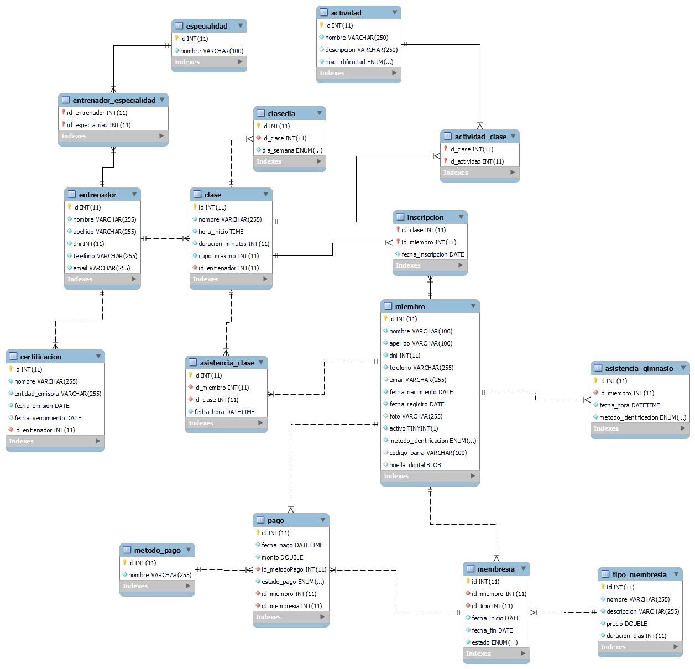

# 🏋️‍♂️ Sistema de Gestión de Gimnasio — Backend + Frontend

Este proyecto es una aplicación completa para la gestión integral de un gimnasio.
Permite administrar miembros, membresías, pagos, actividades, clases, inscripciones y asistencias, integrando tanto el backend (API REST) como un frontend administrativo desarrollado en Vue.

---

## 🚀 Tecnologías Utilizadas
### Backend

- Node.js + Express
- Sequelize ORM
- MySQL
- Dotenv para configuración
- Postman

### Frontend
- Vue 3 + Composition API
- Fetch/axios (según tu setup)
- Componentes reutilizables (BaseCard, Toolbar, etc.)
- SweetAlert2 para mensajes
- Dotenv para configuración

--- 

## 🚀 Diagrama de Base de Datos



--- 

## 📖 Endpoints principales

La URL base de la API es:
```
 http://localhost:<PORT>/api
 ```


| Método | Ruta                    | Módulo        | Descripción                            |
| ------ | ----------------------- | ------------- | -------------------------------------- |
| GET    | `/miembros`             | Miembros      | Lista todos los miembros               |
| DELETE | `/miembros/:id`         | Miembros      | Inactiva un miembro                    |
| GET    | `/clases`               | Clases        | Lista todas las clases                 |
| POST   | `/inscripciones`        | Inscripciones | Inscribe a un miembro a una clase      |
| GET    | `/membresias`           | Membresías    | Lista todas las membresías             |
| POST   | `/pagos`                | Pagos         | Registra un pago y activa la membresía |
| GET    | `/metodopago`           | Pagos         | Lista métodos de pago                  |
| GET    | `/entrenadores`         | Entrenadores  | Lista entrenadores                     |
| GET    | `/actividades`          | Actividades   | Lista actividades disponibles          |
| POST   | `/asistencias/gimnasio` | Asistencias   | Registra asistencia al gimnasio        |
| POST   | `/asistencias/clases`   | Asistencias   | Registra asistencia a una clase        |
| GET    | `/asistencias/reportes` | Asistencias   | Reporte general de asistencias         |


--- 

## 🧪 Ejemplo de `GET /miembros`

*REQUEST*
```
GET /miembros
```

*RESPONSE*
```json
[
  {
    "id": 5,
    "nombre": "Sofía",
    "apellido": "López",
    "dni": 45872341,
    "telefono": "1134567890",
    "email": "sofia.lopez@example.com",
    "fecha_nacimiento": "1999-09-20",
    "fecha_registro": "2025-11-06",
    "foto": null,
    "activo": true,
    "metodo_identificacion": "codigo_barras",
    "codigo_barra": "ffdc0068794d1509f7c15465a886e56acfeb0d3da0a14076ec9b99607435f92d",
    "huella_digital": null,
    "membresias": [
      {
        "id": 5,
        "fecha_inicio": "2025-11-05",
        "fecha_fin": "2025-12-05",
        "estado": "pendiente",
        "tipo": {
          "id": 2,
          "nombre": "Mensual Premium",
          "descripcion": "Acceso total a todas las actividades y clases grupales",
          "precio": 25000,
          "duracion_dias": 30
            }
        }]
    },

  ...
]

```


## Uso del frontend

Incluye vistas para:

- Gestión completa de Actividades
- Asignación de clases a actividades
- ABM de Clase
- Panel de socios
- CRUD de Membresías
- Registro de Asistencias
- Dashboard general


## ⚙️ Configuración
1. Asegurate de tener **MySQL corriendo** y haber creado la base `cuerposano` con la tablas necesarias.
2. Crear un archivo `.env` en la raíz del proyecto con tus datos de conexión:

```env
DB_NAME=cuerposano
DB_USER=root
DB_PASS=tu_contraseña
DB_HOST=localhost // o URL del servidor
DB_DIALECT=mysql
PORT=3006
VITE_API_URL=http://localhost:<PORT>  
```

3. Instalá las dependencias:

```bash
npm install
```

4. Iniciá el servidor:

```bash
npm run dev
```

